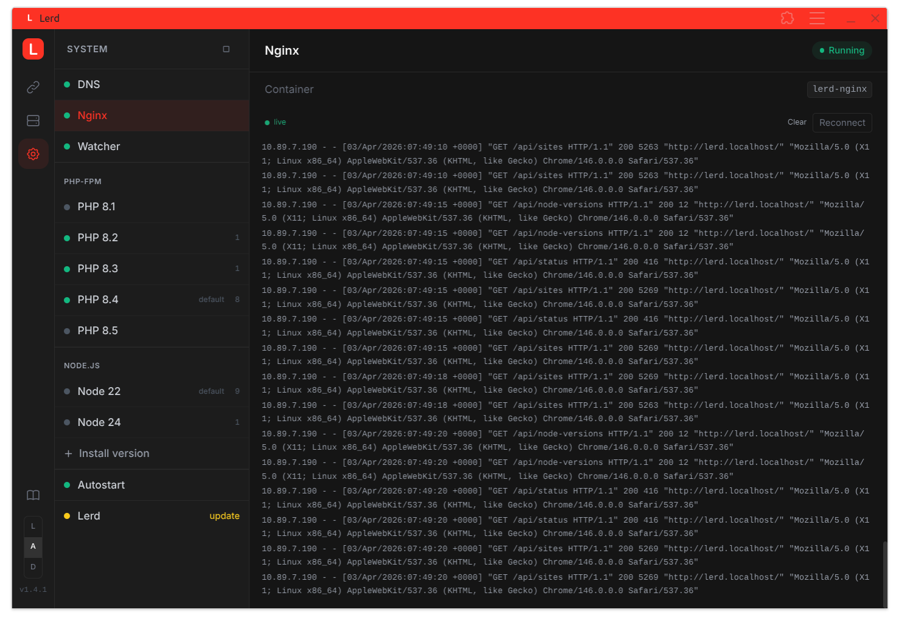
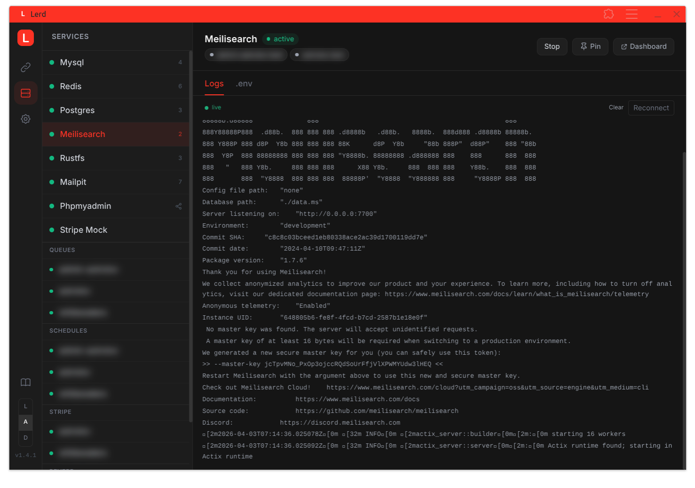

# Web UI

Lerd includes a browser dashboard, served at **`http://127.0.0.1:7073`** by the `lerd-ui` systemd service (started automatically with `lerd install`).

---

## Screenshots

*Sites tab — all registered projects with controls*

*Services tab — start/stop services and copy `.env` values*

*System tab — DNS, nginx, and PHP-FPM health*

---

## Sites tab

Lists all registered projects with their domain, path, PHP version, Node version, and per-site controls:

- **HTTPS toggle** — enable or disable TLS with one click; updates `APP_URL` in `.env` automatically
- **PHP / Node dropdowns** — change the version per site; writes `.php-version` / `.node-version` into the project and regenerates the nginx vhost on the fly
- **Queue toggle** — start or stop the queue worker for a site (available for any framework that defines a `queue` worker); amber when running; click the **logs** link to open the live log drawer
- **Schedule toggle** — start or stop the task scheduler (available for frameworks with a `schedule` worker); live log link when running
- **Reverb toggle** — start or stop the Reverb WebSocket server; only shown when the project actually uses Reverb (detected via composer or `.env`)
- **Framework worker toggles** — any additional workers defined by the site's framework (e.g. Symfony `messenger`, Laravel `horizon`) appear as indigo toggles; each has a live log link when running
- **Stripe toggle** — start or stop the Stripe webhook listener for a site
- **Unlink button** — remove a site from nginx without touching the terminal; for parked sites the directory is left on disk (run `lerd link` to re-register it)
- **Click any row** — opens the live PHP-FPM log drawer at the bottom of the screen

## Services tab

Shows all available services (MySQL, Redis, PostgreSQL, Meilisearch, MinIO, Mailpit) with their current status. Start or stop any service with one click; each panel shows the correct `.env` connection values with a one-click copy button.

Workers (queue, schedule, reverb, and any custom framework workers), Stripe listeners, and infrastructure services are shown together. Per-site worker services are grouped into collapsible accordions (Queues, Schedules, Reverb, Workers). Click a group header to expand it and see the individual per-site entries; only one group is open at a time.

## System tab

Health check panel for DNS, nginx, PHP-FPM containers, the file watcher, installed Node.js versions, and the autostart toggle.

The **Node.js card** lists all versions installed via fnm and includes an inline install form — enter a version number (e.g. `22`) and click **Install**. This is equivalent to running `lerd node:install <version>` from the terminal.

The **Watcher card** shows whether `lerd-watcher` is running. When stopped, a **Start** button appears to restart it from the UI without opening a terminal. The card also streams live watcher logs (DNS repair events, fsnotify errors, worktree timeouts) directly in the browser.

## Updates

Shows the current and latest version. When an update is available, a notice with the version number is shown alongside an instruction to run `lerd update` in a terminal (the update requires `sudo` for sysctl/sudoers steps and cannot run in the background).
